# Fluxo da Experiência do Utilizador - Jogo do Galo

## Fluxo Principal do Jogo

```mermaid
flowchart TD
    A[Utilizador acede à aplicação] --> B[Landing Page]
    B --> C[Clica em 'Jogar']
    C --> D[Entra na fila de matchmaking]
    D --> E[Timer de 15 segundos inicia]
    E --> F{Encontrou jogador humano?}
    
    F -->|Sim| G[Match encontrado!]
    F -->|Não - Timeout| H[Bot entra automaticamente]
    
    G --> I[Jogo: Humano vs Humano]
    H --> J[Jogo: Humano vs Bot]
    
    I --> K[Início do jogo]
    J --> K
    
    K --> L[Determinar quem joga primeiro]
    L --> M{É a minha vez?}
    
    M -->|Sim| N[Fazer jogada]
    M -->|Não| O[Aguardar jogada do adversário]
    
    N --> P[Validar jogada]
    P --> Q{Jogada válida?}
    
    Q -->|Não| R[Mostrar erro]
    R --> N
    
    Q -->|Sim| S[Atualizar tabuleiro]
    S --> T{Jogo terminou?}
    
    T -->|Não| U[Alternar vez]
    U --> M
    
    T -->|Sim| V{Resultado?}
    
    O --> W[Receber jogada do adversário]
    W --> S
    
    V -->|Vitória| X[🎉 Parabéns! Venceste!]
    V -->|Derrota| Y[😔 Perdeste...]
    V -->|Empate| Z[🤝 Empate!]
    
    X --> AA[Modal de resultado]
    Y --> AA
    Z --> AA
    
    AA --> BB{Quer jogar novamente?}
    
    BB -->|Sim| D
    BB -->|Não| CC[Voltar ao início]
    CC --> B
    
    %% Estados de erro/interrupção
    D --> DD{Conexão perdida?}
    DD -->|Sim| EE[Tentar reconectar]
    EE --> FF{Reconectou?}
    FF -->|Sim| GG[Voltar ao jogo em curso]
    FF -->|Não| HH[Erro de conexão]
    HH --> B
    
    GG --> M
    
    %% Abandono de jogo
    M --> II{Jogador abandonou?}
    II -->|Sim| JJ[Vitória por abandono]
    JJ --> AA
```



## Fluxo de Matchmaking Detalhado

```mermaid
sequenceDiagram
    participant U as Utilizador
    participant F as Frontend
    participant B as Backend
    participant R as Redis
    participant Bot as Bot Service
    
    U->>F: Clica "Jogar"
    F->>B: WebSocket: join-queue
    B->>R: Adicionar à fila
    B->>F: queue-status (posição na fila)
    
    loop Timer 15 segundos
        B->>R: Verificar fila
        alt Encontrou match
            B->>F: match-found
            break
        else Sem match
            B->>F: queue-status (countdown)
        end
    end
    
    alt Match humano encontrado
        B->>F: game-start (vs humano)
        Note over F: Iniciar jogo PvP
    else Timeout - sem match
        B->>Bot: Criar bot
        B->>F: game-start (vs bot)
        Note over F: Iniciar jogo vs IA
    end
```

## Estados da Interface


## Interações do Tabuleiro

```mermaid
flowchart LR
    A[Clique na célula] --> B{Célula vazia?}
    B -->|Não| C[Shake animation + erro]
    B -->|Sim| D{É a minha vez?}
    D -->|Não| E[Highlight vez do adversário]
    D -->|Sim| F[Colocar símbolo]
    F --> G[Animação de entrada]
    G --> H[Verificar vitória]
    H --> I{Há vencedor?}
    I -->|Não| J[Passar vez]
    I -->|Sim| K[Animação de vitória]
    K --> L[Destacar linha vencedora]
    J --> M[Aguardar adversário]
    
    %% Bot response
    M --> N{Adversário é bot?}
    N -->|Sim| O[Delay 500-1500ms]
    O --> P[Bot faz jogada]
    P --> F
    N -->|Não| Q[Aguardar WebSocket]
    Q --> R[Receber jogada]
    R --> F
```


